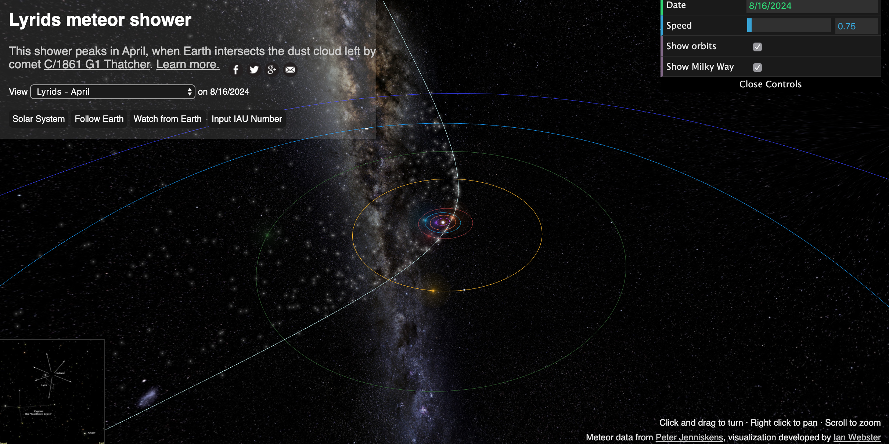
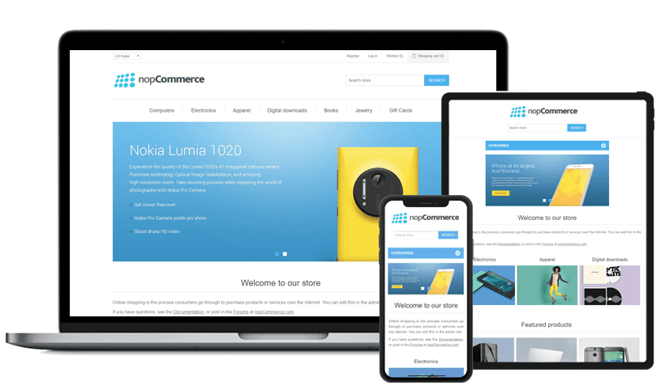
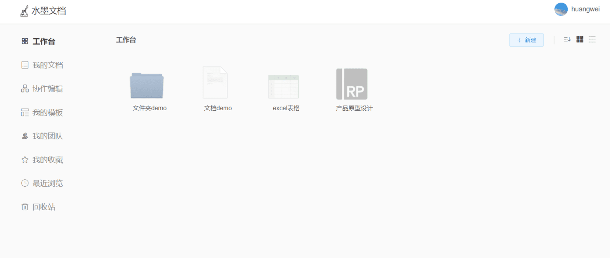
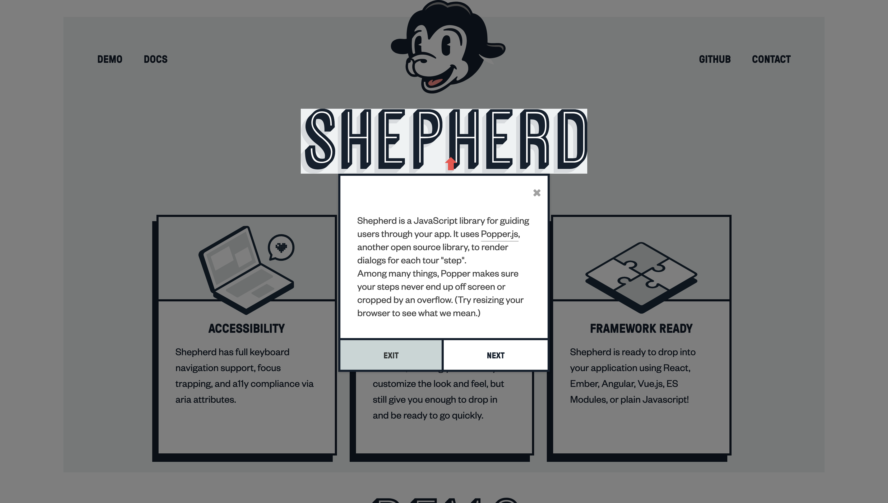

> 发现好点子，分享有趣网站，推荐优质开源，让你找到为之行动的事！分享、点赞、星标，不要错过，每周三发布。
### 奇思妙想
1、Spotify(音乐流媒体平台)上的一项功能可以按节奏对播放列表进行排序，这样当派对开始时，节奏可以随着夜晚的进行逐渐增强。

2、一个这样的网站，可以根据你的IP生成与你所在国家相符的头像。

3、AR应用程序，输入你喜欢的书名或作者，然后将手机摄像头对准商店的书架，应用程序会突出显示你可能感兴趣的书籍。

4、iPhone提供了在照片上录制声音的功能。当你拍照时，你的手机会录制一段5秒的音频片段，帮助你更多地重温这一时刻。

5、名为“零花钱”的App，父母为完成的家务设定学分。然后，孩子可以将这些积分用于奖励，例如“参加某人16岁生日”

> 发挥你的想象，让上面的话题延伸下去，这或许能成为你的第一款产品。

### 趣味网站
1、 [Text-To-Image Art](https://creator.nightcafe.studio/text-to-image-art "Text-To-Image Art")

根据用户提供的英文句子，使用人工智能模型，自动生成一幅绘画。

2、 [城镇叠叠乐](https://oskarstalberg.com/Townscaper "城镇叠叠乐")

一款轻松惬意的网页游戏，采用唯美的手绘卡通画风格，能让你在无尽的大海上建造出独属于自己的古城镇。

3、 [流星雨](https://www.meteorshowers.org/ "流星雨")

以太空视角查看某个时间流星雨的形成。

4、 [网站设计博物馆](https://www.webdesignmuseum.org/ "网站设计博物馆")

展出 1600 多个网站从 1991 到 2006 年主页的设计。

5、 [Sharkle](https://sharkle.com/ "Sharkle")

每次点击按钮，随机带你去一个炫酷的页面。

### 开源精选
1、 [APIJSON](https://github.com/Tencent/APIJSON "APIJSON")

`语言:Java`|`★:12939`|`♗:1669`

零代码、热更新、全自动 ORM 库，后端接口和文档零代码，前端(客户端) 定制返回 JSON 的数据和结构。

2、 [nopCommerce](https://github.com/nopSolutions/nopCommerce "nopCommerce")

`语言:C#`|`★:7050`|`♗:4018`

免费开源的 ASP.NET 电子商城平台。该项目始于 2008 年，由专业团队开发和维护，大而全的商城项目。支持 Windows、Linux、macOS 平台，还有支持开箱即用的 Docker 部署方式。

3、 [playground-macos](https://github.com/Renovamen/playground-macos "playground-macos")

`语言:TypeScript`|`★:2511`|`♗:209`

一款基于 egg.js+Vue.js 的在线文档管理平台。功能包含：文档编辑和预览、团队管理、访问权限、协作编辑等。

4、 [momo-code-sec-inspector-java](https://github.com/momosecurity/momo-code-sec-inspector-java "momo-code-sec-inspector-java")

`语言:Java`|`★:687`|`♗:110`

IDEA静态代码安全审计及漏洞一键修复插件。

5、 [shepherd](https://github.com/shipshapecode/shepherd "shepherd")

`语言:JavaScript`|`★:9990`|`♗:565`

用来引导用户使用你的应用程序，它使用另一个开源库 Popper.js 为每个“步骤”呈现对话框。

### 说明
如果你能看到这里，说明我们对事物的看法是有共识的，如果你也有不错的想法，新奇有趣的东西，欢迎留言或私聊我。期待中……
