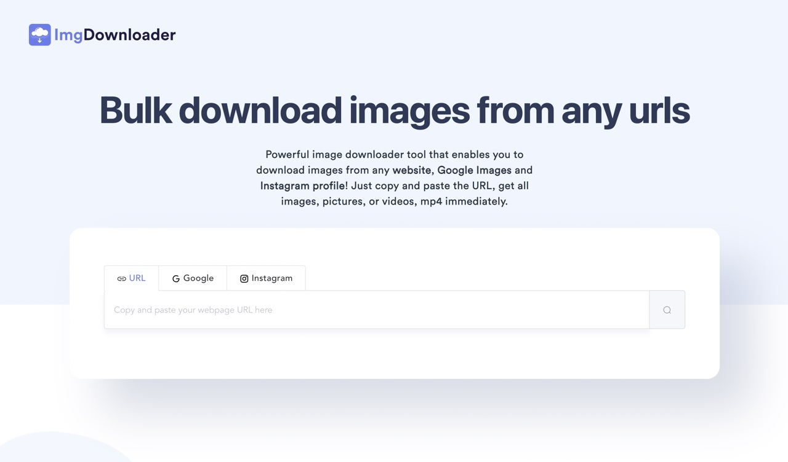
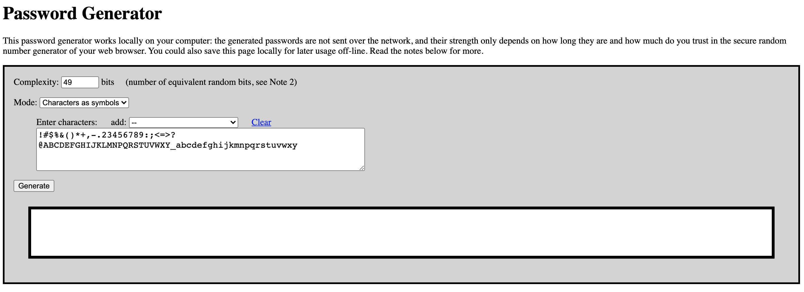
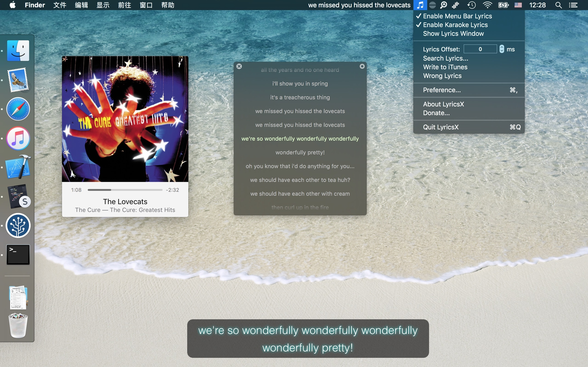
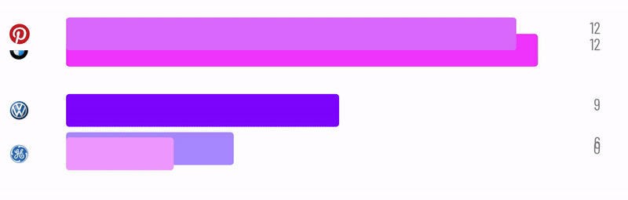
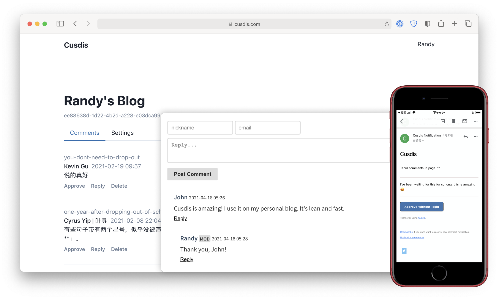
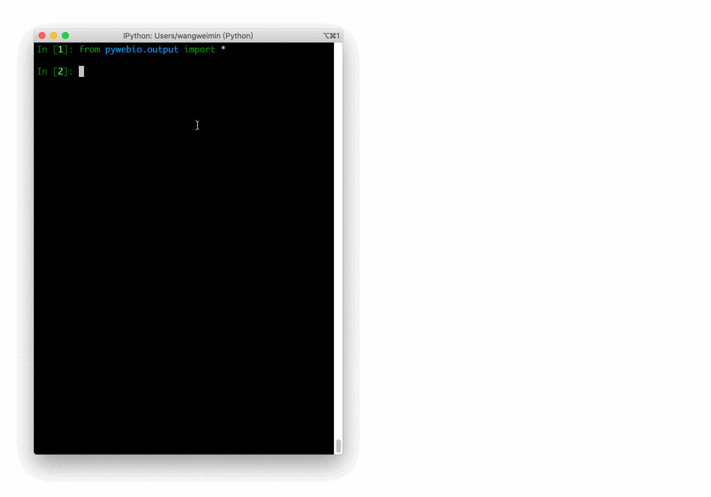

> 发现好点子，分享有趣网站，推荐优质开源，让你找到为之行动的事！分享、点赞、星标，不要错过，每周三发布。
### 奇思妙想
1、在线购物时添加到购物车旁的“打折时通知我”选项。

2、一款应用程序，人们可以查看/排名周围最干净的公共浴室。

3、Snapchat应该将加载动画作为广告空间出售给品牌。

4、所有图书馆都应该有一个咖啡馆。

5、一款天气应用告诉我“今天穿件毛衣”，“带把伞”，“今天是短袖天气”，然后，在一天结束时，你告诉它你是穿得太热，太冷，还是刚刚好，这样它就可以适应你的特定偏好。

> 发挥你的想象，让上面的话题延伸下去，这或许能成为你的第一款产品。

### 趣味网站
1、 [ImgDownloader](https://imgdownloader.com/ "ImgDownloader")

ImgDownloader 是强大的图像下载器工具，可让您从任何网站，Google Images 和 Instagram 个人资料下载图像！只需复制和粘贴 URL，即可立即获取所有图像，图片或视频。

2、 [密码生成器](http://www.icosaedro.it/PasswordGenerator.htm "密码生成器")

一个可以在线生成随机密码的工具。

3、 [wikiHow](https://zh.wikihow.com/ "wikiHow")

一个比较系统的百科指南网站，教你如何做某事。有文字有图片步骤，质量不错。

4、 [爸爸笑](https://dadlaughbutton.com/ "爸爸笑")

点击按钮听一个中年男人的笑声，无聊至极，但却被播放了将近2亿次。

5、 [Picular](https://picular.co/ "Picular")

一款使用 Google 图片搜索快速生成颜色工具，提供颜色十六进制信息，在配色灵感匮乏不知道如何是好的时候，可以试试 Picular。

### 开源精选
1、 [LyricsX](https://github.com/ddddxxx/LyricsX "LyricsX")

`语言:Swift`|`★:3342`|`♗:246`

一个为 iTunes、Spotify、Vox 播放器提供自动下载歌词，并在桌面和任务栏显示的插件

2、 [chart-race-react](https://github.com/bchao1/chart-race-react "chart-race-react")

`语言:JavaScript`|`★:478`|`♗:70`

一个基于React的可定制的条形图表。

3、 [cusdis](https://github.com/djyde/cusdis "cusdis")

`语言:TypeScript`|`★:1776`|`♗:105`

轻量级，隐私友好的 Disqus 替代品。

4、 [go-fly](https://github.com/taoshihan1991/go-fly "go-fly")

`语言:Go`|`★:1189`|`♗:346`

基于Golang语言和MySQL实现的WEB在线客服系统。

5、 [PyWebIO](https://github.com/pywebio/PyWebIO "PyWebIO")

`语言:Python`|`★:2762`|`♗:239`

快速构建 Web 应用的 Python 工具。通过该项目你可在不写 HTML、CSS、JS 代码的前提下，仅用 Python 快速完成一个包含数据展示、表单的小型 Web 应用页面。

### 订阅
如果你能看到这里，说明我们对事物的看法是有共识的，如果你也有不错的想法，新奇有趣的东西，欢迎留言或私聊我。
- Github :  [flyhero/newness-weekly](https://github.com/flyhero/newness-weekly "Github订阅")
- 公众号: 新奇玩家

