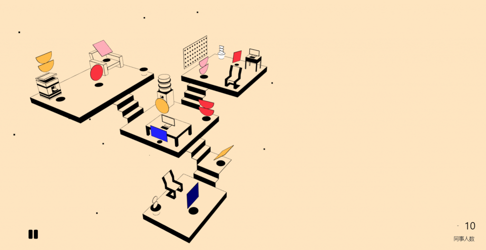
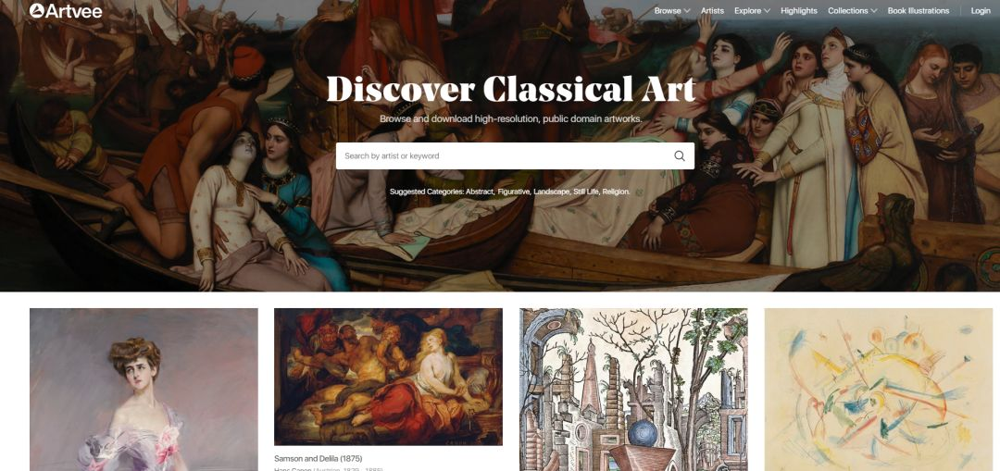
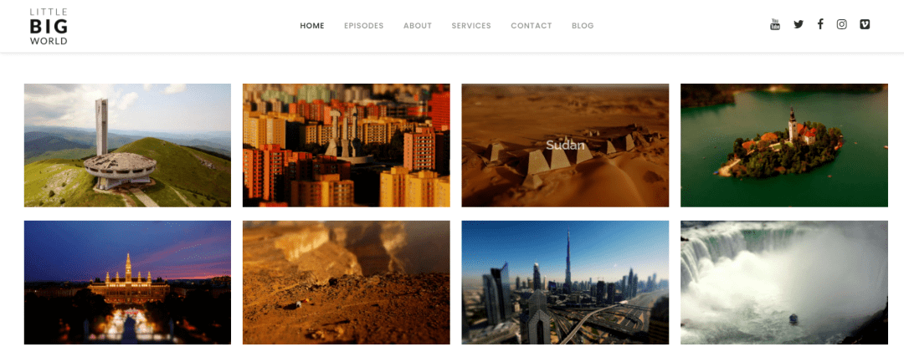
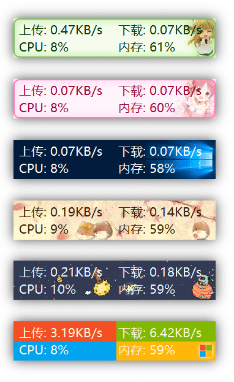
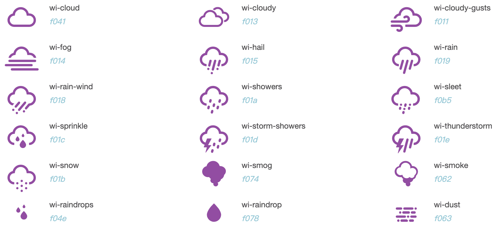

> 发现好点子，分享有趣网站，推荐优质开源，让你找到为之行动的事！分享、点赞、星标，不要错过，每周三发布。
## 奇思妙想
1、两个人互相交谈的播客。一个人说你的语言，另一个人说你想学的语言。

2、你可以付费让人们用外语为YouTube视频编写字幕。

3、智能手机图像文件夹应具有锁定单个图像和使用PIN解锁的选项。因此，如果你向朋友展示一张图片，如果你不想让他们浏览，他们就不能开始浏览你的所有图片。

4、肯定许多人想要改变微信或其他社交软件中的语音播放的速度。

5、电影院应该有一个托儿所，在那里你可以一边看电影一边把孩子们留在那里。

> 发挥你的想象，让上面的话题延伸下去，这或许能成为你的第一款产品。

## 趣味网站
1、 [A4 纸的艺术](http://www.petercallesen.com/home/ "A4 纸的艺术")

以一张 A4 纸，做出许多不可思议的创意作品。

2、 [办公室白噪音](https://imisstheoffice.eu/ "办公室白噪音")

办公室白噪音，可以打开饮水机、打印机、乒乓球等白噪音。

3、 [Taming](https://taming.io/ "Taming")

一款线上RPG生存游戏，像原始人一样收集资源，建立基地、驯服宠物，与其他玩家进行战斗等。

4、 [Artvee](https://artvee.com/ "Artvee")

汇集世界古典艺术大作，堪称线上美术馆。从世界名作到100多年前绘制的插图和广告海报设计，总共有12,000多个项目可供使用。

5、 [Little Big World](https://www.littlebigworld.de/ "Little Big World")

Little Big World 使用移轴摄影、壮观的无人机摄影和惊人的延时，将地球上最美丽、最有趣的地方变成了可爱的微型模型。

## 开源精选
1、 [TrafficMonitor](https://github.com/zhongyang219/TrafficMonitor "TrafficMonitor")

`㊥:C++`|`☆:16540`|`♗:1895`

一款用于 Windows 平台的网速监控悬浮窗软件。可以显示当前网速、CPU及内存利用率、任务栏显示、更换皮肤、历史流量统计等功能。

2、 [djl](https://github.com/deepjavalibrary/djl "djl")

`㊥:Java`|`☆:2383`|`♗:386`

用Java编写的深度学习框架，同时支持训练和推理。

3、 [papercss](https://github.com/papercss/papercss "papercss")

`㊥:SCSS`|`☆:3593`|`♗:192`

一个容易可快速集成的手绘风格的 CSS 库。

4、 [weather-icons](https://github.com/erikflowers/weather-icons "weather-icons")

`㊥:CSS`|`☆:6370`|`♗:811`

包含 220+ 个高质量的天气图标 和 CSS 文件，如果做天气类应用，会需要它。

5、 [magictools](https://github.com/ellisonleao/magictools "magictools")

`㊥:Doc`|`☆:9313`|`♗:857`

GitHub 上一份开源的游戏开发教程：Magic Tools，整理了游戏开发相关的工具、美术素材、项目源码、计算机图形学等资源。

## 订阅
如果你能看到这里，说明我们对事物的看法是有共识的，如果你也有不错的想法，新奇有趣的东西，欢迎留言或私聊我。
- Github :  [flyhero/newness-weekly](https://github.com/flyhero/newness-weekly "Github订阅")
- 公众号: 新奇玩家

