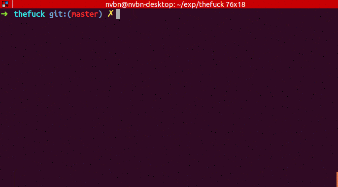
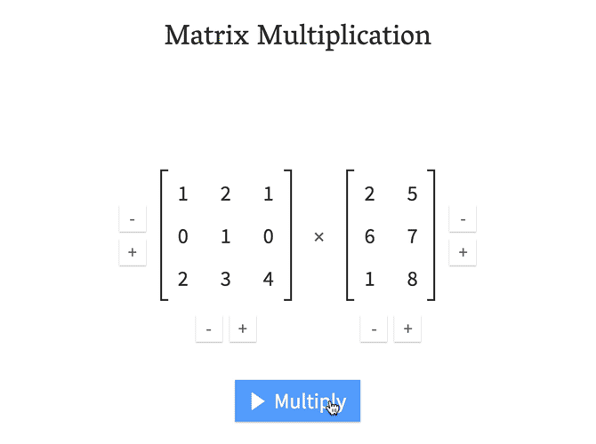

> 发现好点子，分享有趣网站，推荐优质开源，让你找到为之行动的事！分享、点赞、星标，不要错过，每周三发布。
## 奇思妙想
1、预订机票时，优先选择“安静”或“对话”。你坐在有同样偏好的人旁边。

2、一款App，你可以拍下你的垃圾照片，它会向你展示你可以用它制作哪些有趣或实用的项目。

3、打车App中应该增加“请勿打扰”模式，你可以打开该模式，让司机知道你没有心情闲聊。

4、扬声器上的夜间模式，可检测脑电波，并在入睡时关闭音乐。

5、一款App，你可以根据自己的位置找到一条长凳坐下。

> 发挥你的想象，让上面的话题延伸下去，这或许能成为你的第一款产品。

## 趣味网站
1、 [Drive & Listen](https://driveandlisten.herokuapp.com/ "Drive & Listen")

一款给电脑前的同学们纯欣赏使用的小服务，它提供了 49 个城市的开车视频与当地电台，让你可以体验一边听着当地的收音机，一边开车在城市里转悠。

2、 [虚拟乐器](https://www.virtualmusicalinstruments.com/ "虚拟乐器")

网站提供在线演奏乐器，提高学习和创建音乐的可能性。

3、 [你画我猜](https://gartic.io/ "你画我猜")

在线版你画我猜，不登录也可以。

4、 [超声波铃声](http://www.ultrasonic-ringtones.com/ "超声波铃声")

超声波铃声高频听力测试，测试你能听到的高频声音。

5、 [正则表达式可视化编辑](https://regex-vis.com/ "正则表达式可视化编辑")

一个辅助学习、编写和验证正则的工具。它不仅能对正则进行可视化展示，而且提供可视编辑正则的能力。

## 开源精选
1、 [thefuck](https://github.com/nvbn/thefuck "thefuck")

`㊥:Python`|`☆:67149`|`♗:3089`

在 Linux 命令行中，当你输入的命令有错误后，直接输入 fuck 就可以自动执行修复后的命令。

2、 [halo](https://github.com/halo-dev/halo "halo")

`㊥:Java`|`☆:21475`|`♗:7312`

一款现代化的开源博客/CMS系统，主题众多，生态完善，值得一试。

3、 [smartdns](https://github.com/pymumu/smartdns "smartdns")

`㊥:C`|`☆:4664`|`♗:782`

一个本地DNS服务器，获取最快的网站IP，获得最佳上网体验。

4、 [yao](https://github.com/YaoApp/yao "yao")

`㊥:Go`|`☆:2292`|`♗:167`

一款蛮不错的开源低代码应用引擎，无需编写一行代码，即可快速创建 Web 服务和管理后台，大幅解放生产力。该工具内置了一套数据管理系统，通过编写 JSON，帮助开发者完成数据库模型、API 接口编写、管理后台界面搭建等工作，实现 90% 常见界面交互功能。

5、 [matrixmultiplication.xyz](https://github.com/staltz/matrixmultiplication.xyz "matrixmultiplication.xyz")

`㊥:TypeScript`|`☆:865`|`♗:56`

一个「矩阵乘法计算器」，通过交互式动画，帮助你更好的了解与掌握线性代数中的矩阵乘法。它的原理是，当矩阵一的行数和矩阵二的列数相等时，可先将矩阵二中的数值整体向左旋转 90°，然后把矩阵一的值与旋转后矩阵二的值，依次向下相乘相加，进而得出结果。这种解法，被作者称之为「瀑布流」解法。

## 订阅
如果你能看到这里，说明我们对事物的看法是有共识的，如果你也有不错的想法，新奇有趣的东西，欢迎留言或私聊我。
- Github :  [flyhero/newness-weekly](https://github.com/flyhero/newness-weekly "Github订阅")
- 公众号: 新奇玩家

