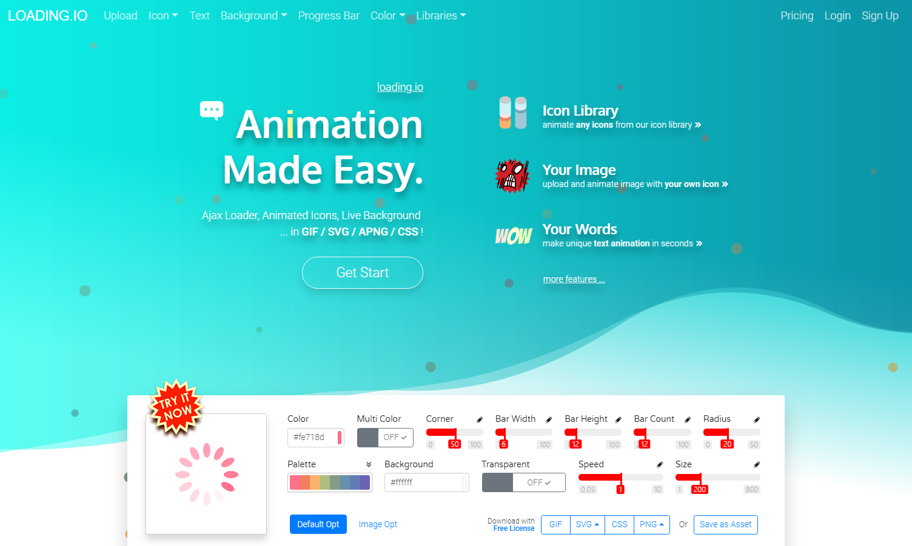
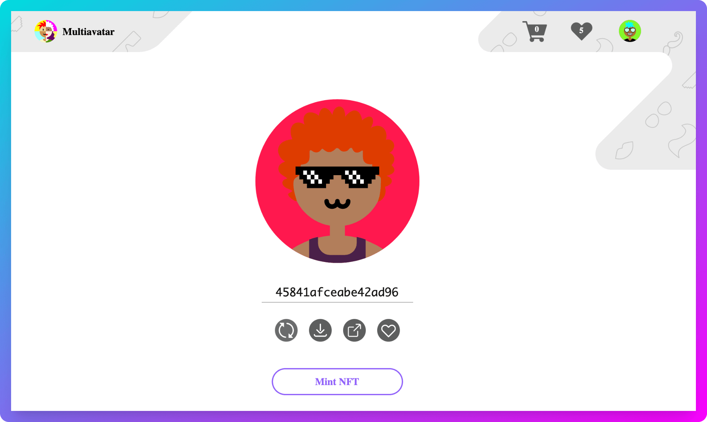
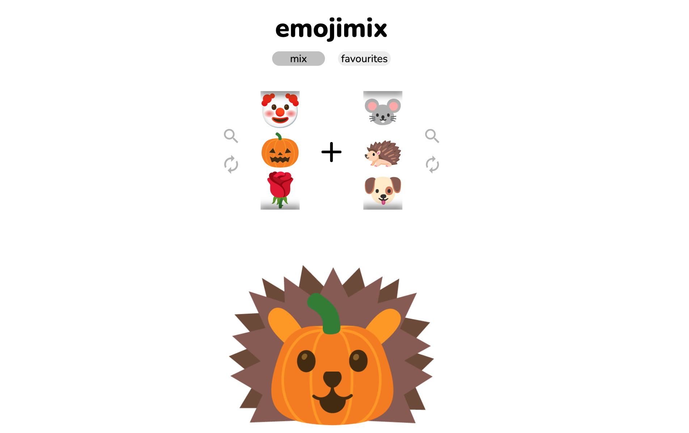
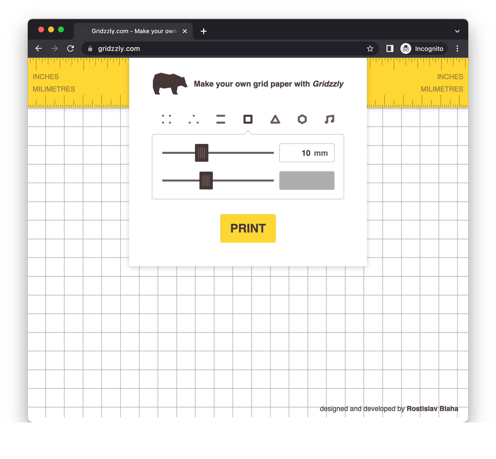
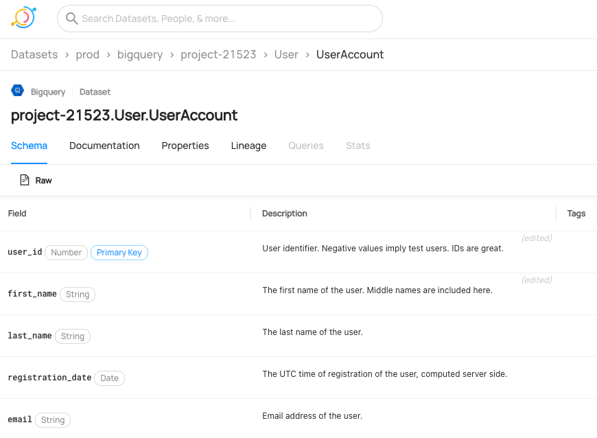
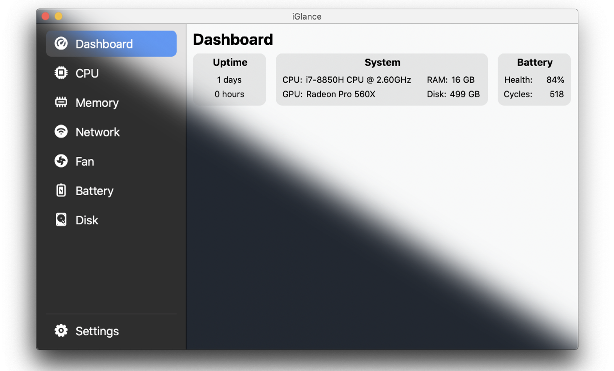
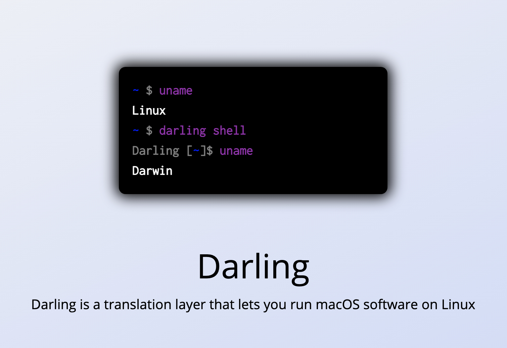

> 发现好点子，分享有趣网站，推荐优质开源，让你找到为之行动的事！分享、点赞、星标，不要错过，每周三发布。
## 奇思妙想
1、当你冲厕时，应该弹出一个防护罩来保护你不受任何喷射的伤害。

2、社交软件应该让用户为不同的分组分配不同的消息铃声。

3、一个网站，它能实时提供你在所有社交网络上的全部关注者。

4、电池供电的自动加热盘可以让食物保持更长时间的热度。

5、一个你可以扫描任何产品的成分的应用程序，它会迅速突出任何有害的东西。

> 发挥你的想象，让上面的话题延伸下去，这或许能成为你的第一款产品。

## 趣味网站
1、 [loading.io](https://loading.io/ "loading.io")

你的 SVG + GIF + PNG Ajax 加载图标和动画生成器。 loading.io 对于前端开发，非常具有价值；它提供了图标、文本、背景、进度条、颜色（调色板生成器），而且还提供了多种 CSS、JavaScript 动画库；这里最值得一提的是，loading.io 提供的背景生成工具，不仅可以生成图片、还可以是动画（SVG）；风格也是多样，如 wave 海浪、trianglify 三角化、confetti 五彩纸屑(用小块落纸庆祝)等等；更难能可贵的是，动画的各种属性，皆可定制；

2、 [捏咔](https://www.neka.cc/ "捏咔")

国内画师绘制的捏捏网站，可以捏出自己喜欢的动漫头像。

3、 [Multiavatar](https://multiavatar.com/ "Multiavatar")

免费的头像生成工具，可产生 120 亿个独特的头像化身。可以免费使用任何生成的头像作为你的头像图片，游戏标志，作为你设计项目的一部分等等。

4、 [emojimix](https://tikolu.net/emojimix "emojimix")

非常适用于创作自己的logo ，将两个不同的 Emoji 符号组合成一个新的符号。

5、 [Gridzzly](https://links.bestxtools.com/www.gridzzly.com/ "Gridzzly")

可以在线制作并打印出可以辅助你绘图的网格纸，界面简洁，操作方便。

## 开源精选
1、 [flameshot](https://github.com/flameshot-org/flameshot "flameshot")

`㊥:C++`|`☆:16701`|`♗:1058`

操作简单、功能强大的截图工具。

2、 [DeepMoji](https://github.com/bfelbo/DeepMoji "DeepMoji")

`㊥:Python`|`☆:1334`|`♗:308`

先进的深度学习模式，用于分析情绪，情感，讽刺等。

3、 [datahub](https://github.com/linkedin/datahub "datahub")

`㊥:Java`|`☆:4917`|`♗:1338`

现代数据堆栈的开放源代码元数据平台。

4、 [iGlance](https://github.com/iglance/iGlance "iGlance")

`㊥:Swift`|`☆:1970`|`♗:97`

免费的系统监视器 OSX 和 macOS，看到所有的系统信息一目了然在菜单栏。

5、 [darling](https://github.com/darlinghq/darling "darling")

`㊥:C`|`☆:8734`|`♗:346`

可让你在 Linux 上无缝运行 macOS 系统软件。  该工具主要具备以下几种特性：  1. 快速：无需添加任何硬件虚拟设备； 2. 免费：基于 GNU GPL 协议开源； 3. 兼容：完美兼容苹果开发的 Darwin 系统； 4. 便捷：默认操作已配置完毕，无需其它操作； 5. 原生：致力于让上面所有集成软件用着都像 Linux 原生软件。

## 订阅
如果你能看到这里，说明我们对事物的看法是有共识的，如果你也有不错的想法，新奇有趣的东西，欢迎留言或私聊我。
- Github :  [flyhero/newness-weekly](https://github.com/flyhero/newness-weekly "Github订阅")
- 公众号: 新奇玩家

